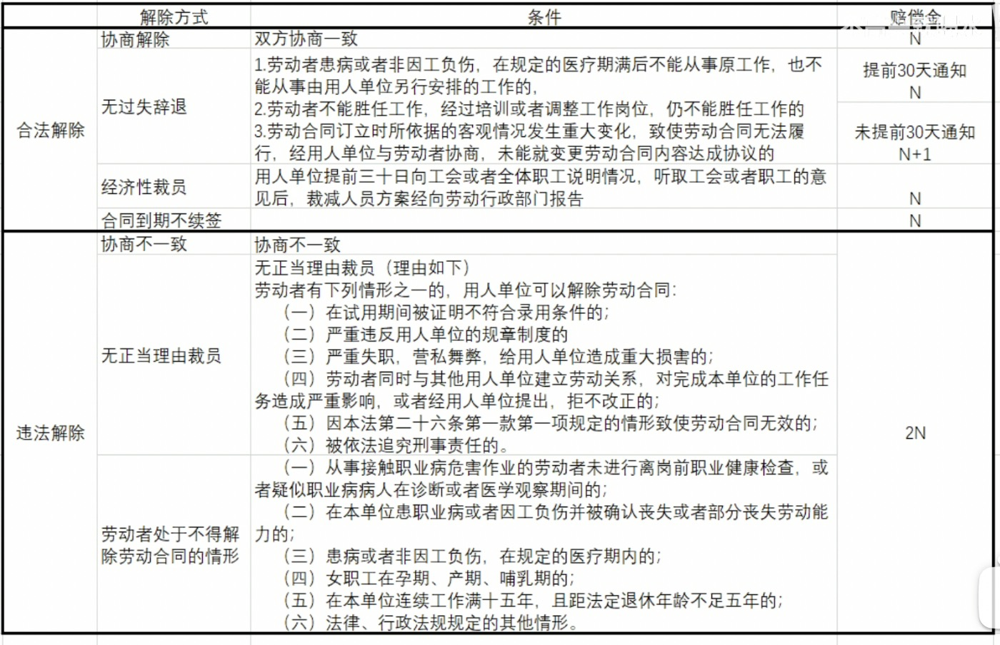

# 裁员维护权益指南

> 合理的裁员，赔偿到位，好聚好散。
> 非法的裁员，维护自己的合法权益。

正好前一段时间看B站博主[不高兴就喝水](https://space.bilibili.com/412704776) 关于裁员自保的
视频：[恶意裁员自保指南 | 公司芭比Q前兆 | 被裁后到底能拿多少钱](https://www.bilibili.com/video/BV1Cu411e78K?spm_id_from=333.999.0.0)
博主风趣幽默讲述了有裁员迹象的表现，以及如何保留好对自己有利相关的证据，值得一看。

保留好对自己有利相关的证据非常重要！！！

保留好对自己有利相关的证据非常重要！！！

保留好对自己有利相关的证据非常重要！！！

重要的事情说三遍！

因为当遇到恶意裁员的公司会非常恶心在与你谈话之后，会收回你在公司的访问权限，那么你就在也没有机会了。
在遇到谈话前当知道会议主题后，申请先上个厕所也好，考虑半小时也好等等借口，对以下记录进行保存留档。如果感觉公司有裁员的迹象，也可以提前备份，未雨绸缪。
* 上班打卡记录
* 日报周报
* 项目管理软件中的工作记录
* 加班记录
* 工作邮件
* 等等相关能证明你在当前公司工作并且能胜任工作的记录

在跟公司谈话期间，也准备好手机录音。谈话期间保持冷静，如果遇到恶心的对话没必要愤怒，不值当。
我们已经准备好材料，拿起法律武器来维护我们的自身权益。
来自B站网友[ReisXT](https://space.bilibili.com/275676716)的评论回复
1. 期间称呼对方一次；
2. 对方如果或明或暗提出我们工作能力有问题，不要墨迹直接回绝否认；
3. 对方如果打温情牌，说我们没问题，但是公司实在困难之类的，正好，要的就是一句我们工作没问题
4. 自己的诉求没有得到满足前，不要签订任何协议，除非协议的补偿是你认可的，这会影响劳动仲裁；尤其是不要被hr忽悠提前提离职申请
>  “不要怕麻烦，不怕走劳动仲裁”的态度要表现出来，但不要威胁单位

合理的维护自身的权益，不要夸大的索取，威胁单位。避免陷入敲诈勒索的陷阱。恶心的公司也会通知敲诈勒索来反咬我们一口。

下面是来自B站博主[不高兴就喝水](https://space.bilibili.com/412704776) 整理的被裁后到底能拿多少钱
> 

## 关于**N**的说明
N：指的是在公司所待的年限*月薪。六个月以上不满一年的，按一年计算；不满六个月，按半年计算。
举例说明：如果A在公司带了9个月被公司裁员，正好在疫情封控期间，根据六个月以上不满一年的，按一年计算。那么公司应该赔偿（2 * 1 * 月薪）

## 疫情封控期间非法裁员
[《人力资源社会保障部办公厅关于妥善处理新型冠状病毒感染的肺炎疫情防控期间劳动关系问题的通知》](http://www.mohrss.gov.cn/xxgk2020/fdzdgknr/zcfg/gfxwj/ldgx/202002/t20200227_360811.html)

一、对新型冠状病毒感染的肺炎患者、疑似病人、密切接触者在其隔离治疗期间或医学观察期间以及因政府实施隔离措施或采取其他紧急措施导致不能提供正常劳动的企业职工
，企业应当支付职工在此期间的工作报酬，并**不得依据劳动合同法第四十条、四十一条与职工解除劳动合同**。
在此期间，**劳动合同到期的，分别顺延至职工医疗期期满、医学观察期期满、隔离期期满或者政府采取的紧急措施结束**。

人力资源社会保障部在2020年疫情之后发文在疫情期间劳动关系问题的通知
，在疫情封控的特殊时间不得依据劳动合同法第四十条、四十一条与职工解除劳动合同，如果公司在封控管理期间还是进行裁员，属于公司自己原因的非法裁员。
应当依照该法第四十七条规定的经济补偿标准的二倍向劳动者支付赔偿金。俗称的**2N**。

## 申请劳动仲裁
当我们和公司协商不下去，不能得到相应的权益时，也不知道如何进行劳动仲裁时，可以拨打**12345**政府服务热线进行咨询。
可以了解到公司所在地的劳动仲裁委员会电话地址信息，已经申请的流程。

劳动仲裁不像是打官司，没必要请律师，没必要请律师，没必要请律师。只要我们事先准备好的材料，陈述事实就好。

相信其实很多被非法的暴力裁员，也没有得到相应的经济补偿。因为劳动仲裁本身是一件耗时耗力的过程，大多数人都会选择放弃。
公司有专业的法务团队，个人拿起法律的武器还是只能单打独斗。但是我们要有“不要怕麻烦，不怕走劳动仲裁”的态度。
希望大家联合起来，无产阶级联合起来。

[劳动仲裁的经验](https://sspai.com/post/66272)

## 非法裁员公司列表

虽然说公司是以盈利为目的，但能承担社会责任感，遇到不可抗力的情况是也能够给予公司合理的经济补偿是好公司。
而有的公司却通过裁员的方式来转嫁成本，只为盈利，只为股东的利益。
而员工在需要的时候把你当兄弟，家人。不需要的时候总是第一个被牺牲的。
如果有遇到非法裁员的朋友，欢迎issue。也给后续这些公司的面试者一些温馨的提醒。

| 公司名称 | 裁员时间     | 城市 | 备注   | 
|------|----------|----|------|
| 百度  | 2022-4-1 | 北京 | 非法裁员 |
|    |          |    |      | 
|      |          |    |      |  
|      |          |    |      |  
|      |          |    |      |  
|      |          |    |      |  
|      |          |    |      |   
|      |          |    |      |  
|      |          |    |      |  
